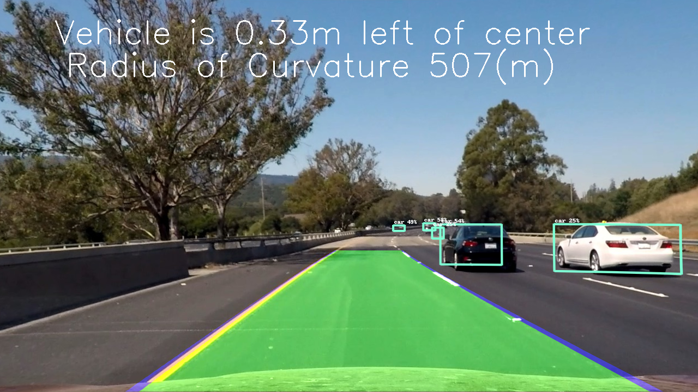
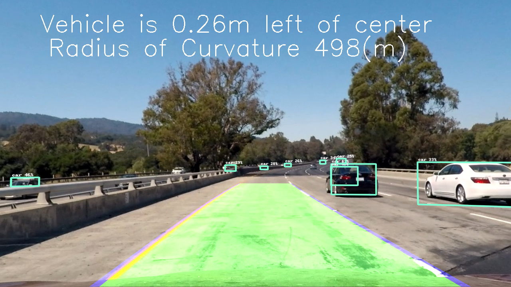

# Lane-And-Vehicle-Detection

In this project I have used OpenCV and the [Tensorflow Object Detection API](https://github.com/tensorflow/models/tree/master/research/object_detection) to identify the lane lines and other vehicles on the highway. I have also attempted to measure the radius of curvature of the road and calculate how far the car has deviated from the center of the lane.


### Code:

##### Setup:

This project requires python 3.5 and the following dependencies:

- [NumPy](http://www.numpy.org/)
- [SciPy](https://www.scipy.org/)
- [matplotlib](http://matplotlib.org/)
- [OpenCV](http://opencv.org/)
- [MoviePy](http://zulko.github.io/moviepy/)
- [TensorFlow](https://www.tensorflow.org/)

##### Object Detection Model:

Download one of the pretrained models from [here](https://github.com/tensorflow/models/blob/master/research/object_detection/g3doc/detection_model_zoo.md). For faster processing I recommend one of the SSD models. 

*Note:* You may need to adjust line 306 in `main.py` depending one which model you use and where you save it.

##### Run:

The script `main.py` takes 3 arguments: MODE, INPUT, OUTPUT.
 - MODE can be `image` or `video` depending on whether you want to process a single image or a video.
 - INPUT should be the name of the input image or video you wish to process.
 - OUTPUT should be the name of the output image or video you wish to write (images should be .png) 
 
 Video Example:
 ```
 python main.py video project_video.mp4 output_video.mp4
 ```
 
 Image Example:
 ```
 python main.py assets/test_image.jpg test_output.png
 ```
 
 ### Output:
 
 ##### Single Image:
 |||
 |-------|-------|
 |||
 
 ##### Video:
 
 
 ### References:
 [Tensorflow Object Detection API](https://github.com/tensorflow/models/tree/master/research/object_detection)
 
 [Udacity Self Driving Car Nanodegree](https://www.udacity.com/course/self-driving-car-engineer-nanodegree--nd013)
